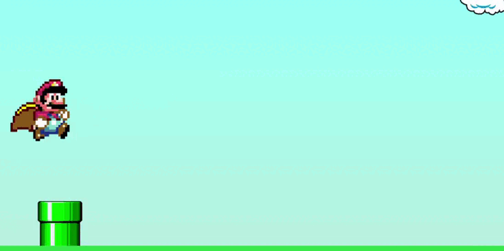

# Mario Game

  
  
  

 

Projeto simples desenvolvido em Javascript para ser um jogo de run and jump

 

---

Desenvolvido Por [Alessandro Massarotti Jr](https://github.com/alessandro-massarotti-jr) 🤖